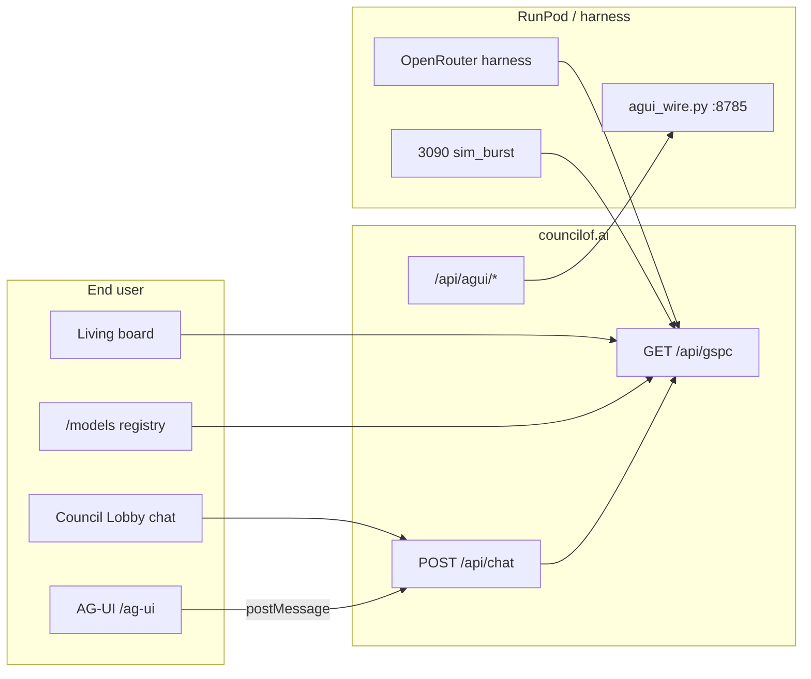

# Chat, AG-UI, and OpenRouter — one system, three layers

**Updated:** 2026-08-23

## Short answer: is the chat page our AG-UI?

**No — and they are converging.**

| Surface | URL | What it is |
|---|---|---|
| **Council Lobby chat** | `/?lobby=home` (badge on every page) | **Primary public chat.** Grounded answers via `POST /api/chat`. Beautiful Council OS shell with iframe panes (board, verify, arena). |
| **AG-UI static** | `/ag-ui` → iframe `ag-ui.html` | **15-tab axis measurement UI.** Per-axis tools, competitor research, scoreboard links. Chat was local-only; now wires to `/api/chat` when embedded. |
| **AG-UI wire** | `/api/agui/*` → RunPod `agui_wire.py` | **Agent protocol layer.** SSE events, HITL consent, hash-chained ledger. For agents and power users — not the lobby chat bar. |

**One contract for all chat:** every surface uses `POST /api/chat` and shows the same `state` pill:

- `grounded` — deterministic, from published measurement
- `live` — SOV gate specialist (GPU pod, not OpenRouter on apex)
- `ungrounded` — refused, no invented numbers
- `deterministic` — local pane command, no network

---

## Where OpenRouter fits

OpenRouter is **not** on the public web chat path. It powers the **measurement harness** that feeds the board:

```
OpenRouter API (cross-lab models)
  → openrouter_board.py / spray_openrouter.py / sovos.py
    → benchmark-results / signed receipts
      → GET /api/gspc (living board)
        → LiveLeaderboard, GspcScoreboard, ModelRegistry, Lobby panes
```

| Layer | OpenRouter? | Repo |
|---|---|---|
| Public chat (`/api/chat`) | No — uses SOV_GATE or grounded rules | `councilof-ai` |
| Board truth (`/api/gspc`) | Metadata only ("measured on OpenRouter cross-lab") | `councilof-ai` |
| Cross-company harness | Yes — `OPENROUTER_API_KEY` | `csoai-static-deploy2` |
| City simulation citizens | Yes — capped spend | `SOVOS/sovos_city/openrouter.py` |
| RunPod 3090 sim_burst | Local Ollama, not OR | `trigger_3090_sims.sh` |

**Positioning:** OpenRouter routes inference for measurement runs; CSOAI signs and publishes the result. The site never sells OpenRouter as the public chat backend.

---

## E2E flow (ask → measure → board → verify)



---

## Beautiful design seams (keep these)

1. **LiveLeaderboard** on home — same data as `/gspc-scoreboard`, links to lobby with `?ask=` pre-filled
2. **CouncilLobby** — left panes (board/verify/arena), center chat, right thread rail
3. **AG-UI** — 15 axis tabs, tool chips per axis, same emerald/slate palette
4. **ModelRegistry** `/models` — fleet from `/api/gspc`, not hardcoded
5. **State pills** on every answer — never hide which lane produced text

---

## Deploy checklist (make it all work)

- [ ] `/ag-ui` serves `AgUiBridge` (not 308 to lobby)
- [ ] `/agui` → `/ag-ui` redirect
- [ ] `AGUI_WIRE_URL` set on Cloudflare Pages (RunPod wire)
- [ ] Gated deploy runs `place-end-user-aliases.mjs` (bare paths 200)
- [ ] Static `ag-ui.html` uses parent postMessage → `/api/chat`
- [ ] `node scripts/e2e-integration-stack.mjs` green

See also: [`FRONTEND_AUDIT_CHECKLIST.md`](FRONTEND_AUDIT_CHECKLIST.md), [`MONOREPO_RUNPOD_OPS.md`](MONOREPO_RUNPOD_OPS.md).
